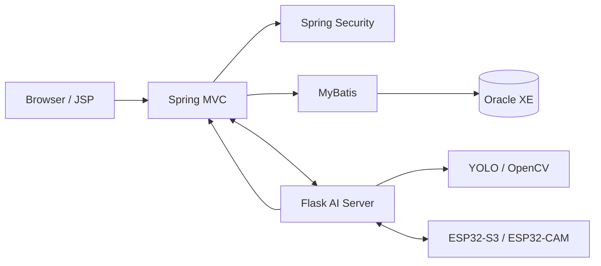
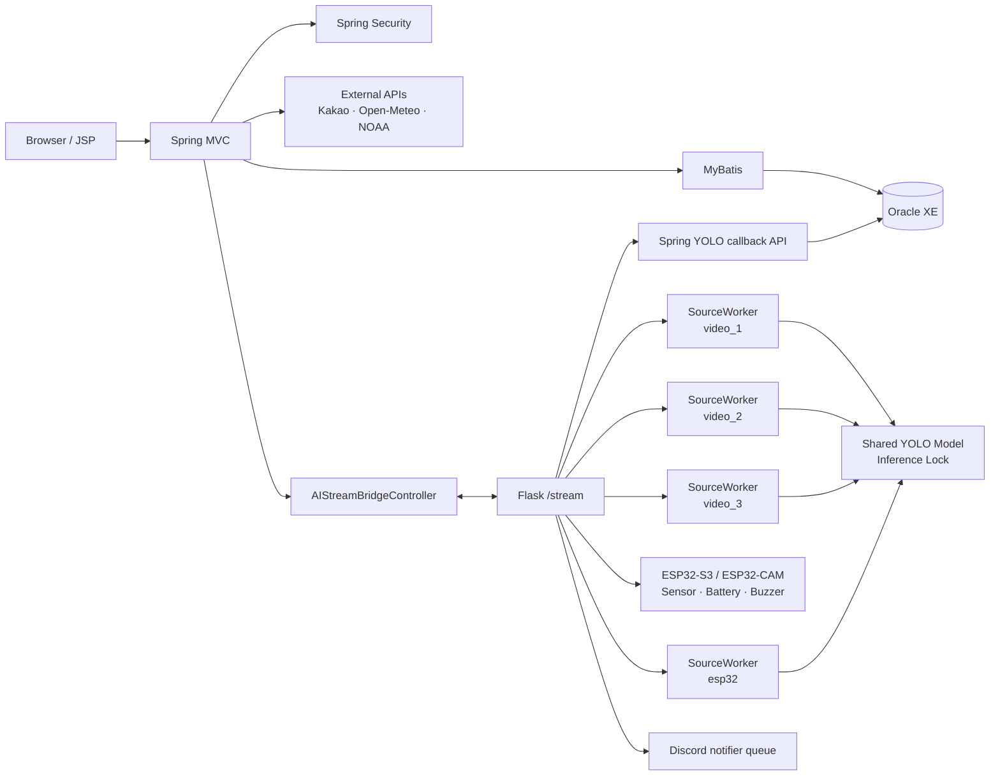
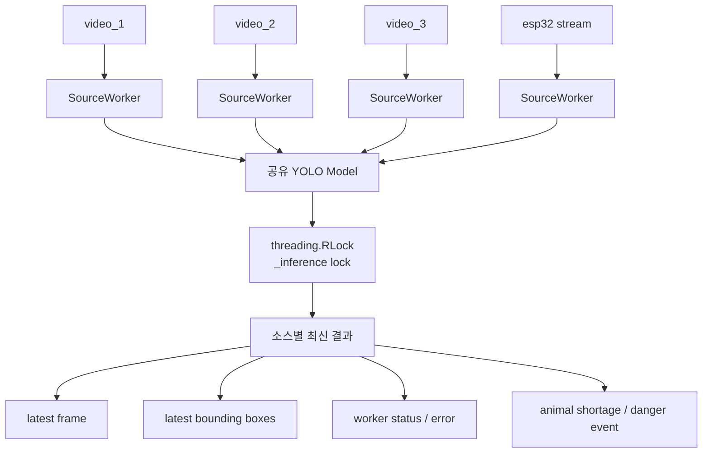

# SSA - 유기동물 보호소 통합 관제 시스템


Spring MVC, Flask, YOLO, Oracle, ESP32를 연동해 실시간 영상 관제, AI 객체 탐지, 센서 모니터링, 경보 알림 및 운영 관리를 제공하는 유기동물 보호소 통합 관제 시스템입니다.

> 이 문서는 현재 저장소의 Spring Mapper, JSP, Python 서비스, SQL 초기화 스크립트 및 설정 파일을 기준으로 작성되었습니다. 실제 키, DB 비밀번호, Webhook URL, 로컬 경로는 문서에 포함하지 않습니다.
> 
## 👥 팀원 소개 및 담당 역할

| 팀원 | 역할 & 기술 스택 | 담당 업무 |
| :---: | :---: | :--- |
| **강동현** | **TEAM LEAD**<br>`PM` · `통합 설계` | • 프로젝트 총괄 및 요구사항 정리<br>• 발표 자료 구성<br>• 시스템 통합 및 일정 관리 |
| **서기원** | **AI / STREAM**<br>`YOLO` · `Flask` | • **YOLO 객체 탐지 모델 구현**<br>• **Flask SourceWorker 기반 스트리밍 처리**<br>• **탐지 이벤트 연동 및 시스템 개발** |
| **장지웅** | **BACKEND**<br>`Spring` · `DB` | • Spring MVC / Security 활용 권한·로그·관리 기능 구현<br>• MyBatis - Oracle 설계 및 연동<br>• 화면 전체 프레임 설계 |
| **배가영** | **IOT / UI**<br>`ESP32` · `JSP` | • ESP32 센서 / 배터리 / 부저 연동<br>• mpremote 기반 API 연결<br>• 관제 화면 HUD · JSP 프론트엔드 개발 |


### 프로젝트 목적

제한된 인력으로 여러 보호 구역을 동시에 살피기 어려운 문제를 해결하기 위해, 영상 탐지·센서·운영 데이터를 한 화면에 연결했습니다. 동물 개체수 미달과 위험 객체를 감지하고, 관제 이력·조치·보고서까지 이어지는 운영 흐름을 제공합니다.

### 핵심 구현

- 2×2 화면에서 `video_1~3`과 ESP32-CAM을 독립적으로 처리하는 4채널 관제
- 공유 YOLO 모델과 소스별 `SourceWorker`를 통한 최신 프레임 중심의 저지연 추론
- 동물 미달·위험 객체 이벤트, 스냅샷, Discord 알림 queue, Oracle 이력 연동
- ESP32 환경 센서·배터리·부저 상태를 비동기 worker로 분리한 IoT 연동
- Spring Security 권한 제어, 업무 CRUD, Dashboard, PDF 일일 관제 보고서 및 Workflow

### 주요 기술

| 영역 | 기술 |
| --- | --- |
| Backend | Java 17, Spring MVC, Spring Security, MyBatis, Oracle XE |
| AI / Vision | Python, Flask, Ultralytics YOLO, OpenCV, NumPy |
| IoT | ESP32-S3, ESP32-CAM, MicroPython, `mpremote` |
| Frontend | JSP, JSTL, JavaScript, Chart.js |
| Test | JUnit 5, Mockito, pytest |

### System Architecture



### 구현 범위 (저장소 기준)

- Spring MVC 기반 운영 화면, 권한별 메뉴·URL 접근 제어, MyBatis/Oracle CRUD
- Flask 다중 소스 영상 처리, 탐지 정책, Spring callback 및 notification queue
- ESP32 센서/배터리/부저 연동과 ESP32-CAM MJPEG 입력 안정화
- Dashboard, 탐지·경보 이력, FlightHistory, PDF Cache, PatrolReport 및 Workflow

## 프로젝트 소개

유기동물 보호소는 여러 구역의 상태를 지속해서 확인해야 하지만, 제한된 인력으로 모든 구역을 동시에 관찰하기 어렵습니다. 이 과정에서 동물 개체수 부족, 위험 객체 출현, 장비 상태 이상에 대한 대응이 늦어질 수 있습니다.

SSA는 영상·센서·동물 정보·드론 정보·탐지 이력·직원 업무를 하나의 관제 화면으로 연결하는 것을 목표로 합니다. Spring MVC는 운영 화면과 Oracle 데이터를 담당하고, Flask는 다중 영상 처리와 ESP32 연동을 담당합니다.

## 주요 기능

### 1. YOLO 기반 다중 영상 객체 탐지

- `video_1`, `video_2`, `video_3`, `esp32`의 네 영상 소스를 관리합니다.
- 각 소스는 독립적인 `SourceWorker`가 입력 capture를 소유하고 처리합니다. 로컬 영상은 OpenCV를, ESP32-CAM은 전용 HTTP MJPEG reader를 사용합니다.
- Ultralytics YOLO 모델은 한 번만 로드하며 `_model_inference_lock`으로 추론 동시 접근을 보호합니다.
- Worker는 프레임 큐를 무한히 쌓지 않고 `latest_frame`, 최신 bounding box, 상태, 오류를 보관합니다. 따라서 오래된 프레임보다 최신 프레임을 우선해 관제 지연을 줄입니다.
- 탐지 결과는 동물 개체수 부족 정책과 위험 객체 정책으로 분기되고, Spring API와 Discord 알림 작업으로 전달됩니다.

### 2. 4채널 실시간 관제

- 메인 화면은 2×2 관제 레이아웃으로 네 채널을 표시합니다.
- 채널별 탐지 ON/OFF, MJPEG 영상, 탐지 bounding box, 비행 시간, 배터리와 ESP32 센서 HUD를 제공합니다.
- `VIDEO_DRONE_MAP`으로 영상 소스와 드론 ID를 연결합니다.
- 채널 선택 상태는 사이드바 미니 관제 화면에서도 브라우저 세션 범위로 유지합니다.

### 3. ESP32 IoT 연동

- ESP32-S3 / ESP32-CAM 영상 소스를 관제 채널로 처리합니다.
- MicroPython 장치와는 Python의 `mpremote` 호출을 통해 통신합니다.
- 센서 서비스는 온도, 습도, 조도, 거리와 배터리 상태를 캐시해 제공합니다.
- GPIO2 ADC와 40.2kΩ / 10kΩ 전압 분배 회로 기준의 배터리 보정값을 환경변수로 조절할 수 있습니다.
- 부저 명령은 전용 queue worker가 직렬화하여 YOLO Worker를 막지 않도록 구성했습니다.

### 4. 탐지 이벤트, 알림 및 이력

- 동물 미달 탐지는 `DETECTION_LOG`, 위험 객체 탐지는 `DANGER_LOG`에 기록합니다.
- 경보 전송 이력은 `ALERT_LOG`에 연결됩니다.
- Flask는 이벤트별 스냅샷을 만들고, 설정된 경우 Discord Webhook 알림 작업에 전달합니다.
- 드론 탐지 ON/OFF lifecycle은 `FLIGHT_HISTORY`에 비행 시작·종료·배터리 소모량을 기록합니다.
- 개체수 미달은 인식된 보호 동물이 하나 이상 있는 프레임에서만 비교하며, 보호중(`ANIMAL_STATUS = '0'`) 동물 기준 수를 사용합니다.

### 5. 운영 관리 및 보고

- Member, Drone, Animal, CommonCode, 환경 위치, 위험 객체 마스터를 관리합니다.
- 탐지/위험 로그의 현장 조치 상태를 관리하고 Dashboard 통계를 제공합니다.
- PatrolReport와 Workflow로 일일 관제 보고서 및 승인 흐름을 관리합니다.
- 보고서 PDF는 브라우저 렌더링 기반으로 생성되며 `PDF_CACHE`의 `REQUEST` / `SUCCESS` / `FAIL` 상태와 연계됩니다.
- 관리자 Diagnostics 화면에서 Oracle, Flask, YOLO worker, ESP32 센서·부저, Discord, Kakao, Open-Meteo, NOAA 상태를 읽기 전용으로 확인합니다.

### 6. 인증 및 권한

- Spring Security와 BCrypt 기반 비밀번호 해시를 사용합니다.
- `ROLE_ADMIN`, `ROLE_USER`, `ROLE_GUEST` 권한을 사용합니다.
- `ROLE_GUEST`는 이상 관리 메뉴 그룹에 한정되며, 관리자 기능은 `/admin/**`에서 실제 권한 검사를 받습니다.
- JSP 메뉴는 권한에 따라 렌더링되지만, URL 접근 제한은 Spring Security가 별도로 수행합니다.

## 시스템 아키텍처



## YOLO 다중 영상 처리 구조



`SourceWorker`만 자신의 입력 capture를 열고 해제합니다. HTTP MJPEG generator와 Discord worker는 capture를 직접 소유하지 않고, 최신 결과만 읽습니다. 영상 조회 또는 채널 전환은 비행 이력 lifecycle을 시작·종료하지 않으며, 탐지 시작/중지가 그 책임을 가집니다.

## 기술 스택

| 영역 | 실제 사용 기술 |
| --- | --- |
| Frontend | JSP, JSTL, HTML, CSS, JavaScript, Chart.js |
| Backend | Java 17, Spring MVC 6.2, Spring Security 6.2, MyBatis 3, Jackson |
| Database | Oracle XE, JDBC, HikariCP, log4jdbc |
| AI / Video | Python, Flask, Ultralytics YOLO, OpenCV, NumPy |
| IoT | ESP32-S3, ESP32-CAM, MicroPython, `mpremote` |
| External API | Kakao Local, Open-Meteo, NOAA SWPC, Discord Webhook |
| Server | Apache Tomcat 10.1, Flask built-in server (`run_server.py`) |
| Build / Test | Maven, JUnit 5, Mockito, pytest |
| Development | Eclipse, VS Code, SQL Developer, Thonny, Git |

## 데이터베이스

Oracle XE를 사용합니다. 신규 개발 DB는 아래 초기화 스크립트 순서로 구성합니다.

| 대상 | 내용 |
| --- | --- |
| `project_ssa_spring/db_script/01_schema.sql` | 현재 Mapper가 사용하는 19개 테이블, PK/FK, CHECK 제약, 기본값, 테이블 설명 및 인덱스 |
| `project_ssa_spring/db_script/02_sequences.sql` | Mapper의 `NEXTVAL` 사용처와 일치하는 시퀀스 생성 |
| `project_ssa_spring/db_script/03_seed_system.sql` | 애플리케이션 구동에 필요한 도메인 코드와 안전한 개발용 기준 데이터 |
| `project_ssa_spring/db_script/migrations/` | 개발 과정에서의 DB 변경 이력. 신규 설치에서는 최신 `01~03`을 먼저 실행합니다. |

### 현재 Mapper 기준 시퀀스

```text
ALERT_LOG_SEQ
DETECTION_LOG_SEQ
DANGER_LOG_SEQ
SEQ_ENVIRONMENT
SEQ_FLIGHT_HISTORY
SEQ_PDF_CACHE
```

`MEMBER_ROLE`, `MEMBER_LOG`, `ANIMAL_DETAIL`, `DANGER_DETAIL`, `PATROL_REPORT`, `WORKFLOW`는 현재 Mapper의 `MAX(...)+1` 방식을 그대로 사용하므로 별도 시퀀스를 만들지 않습니다.

### 초기 데이터

`03_seed_system.sql`에는 다음 최소 데이터만 포함됩니다.

- `COMMON_CODE`: 계정, 역할, 동물, 위험 객체, 경보, 조치, 보호 상태 코드
- `DANGER_DETAIL`: 현재 YOLO 위험 객체 코드 `2~5`
- `ANIMAL_DETAIL`, `ANIMAL_COUNTER`: 보호중 동물 기준 수를 위한 샘플 데이터
- `DRONE`, `VIDEO_DRONE_MAP`: `video_1~3`, `esp32`의 기본 드론 매핑
- `ENVIRONMENT`, `ALERT_POLICY`, `ALERT_MESSAGE_TEMPLATE`
- 개발용 `admin` 계정과 `ROLE_ADMIN`

`MEMBER_LOG`, `DETECTION_LOG`, `DANGER_LOG`, `ALERT_LOG`, `FLIGHT_HISTORY`, `PATROL_REPORT`, `PDF_CACHE`, `WORKFLOW`는 실행 중 생성되는 이력 데이터이므로 seed하지 않습니다.

### Oracle 초기화 순서

프로젝트용 Oracle User/Schema를 만든 뒤, 해당 계정으로 아래 순서대로 실행합니다.

```sql
@01_schema.sql
@02_sequences.sql
@03_seed_system.sql
```

이 초기화 스크립트는 빈 개발 스키마용입니다. 기존 데이터가 있는 DB에 재실행하지 마세요.

### 개발용 관리자 계정

| Item | Value |
| --- | --- |
| ID | `admin` (개발 seed 전용) |
| Role | `ROLE_ADMIN` |

> 개발 및 시연 환경의 초기 로그인 검증을 위한 seed 계정입니다. 실제 비밀번호는 README에 기록하지 않습니다. 공유·운영 환경에서는 반드시 별도 관리자 계정을 생성하고 seed 계정을 제거하거나 자격 증명을 변경하세요.

## 환경 설정

### Spring / Tomcat

1. `project_ssa_spring/src/main/resources/com/spring/properties/jdbc.properties.example`을 참고해 같은 경로에 로컬 `jdbc.properties`를 만듭니다.
2. `YOUR_USERNAME`, `YOUR_PASSWORD`를 개인 Oracle 계정 값으로 바꿉니다.
3. Eclipse에서는 **Servers → Tomcat → Open Launch Configuration → Environment**에서 환경변수를 추가합니다.

| 변수 | 용도 |
| --- | --- |
| `KAKAO_REST_API_KEY` | Kakao Local API 인증 |
| `SSA_FLASK_STREAM_URL` | Flask `/stream` base URL |
| `SSA_FLASK_ESP32_VIDEO_URL` | Flask ESP32 영상 endpoint URL |
| `SSA_FLASK_VIDEO_CONNECT_TIMEOUT_MS`, `SSA_FLASK_VIDEO_READ_TIMEOUT_MS` | Flask 영상 proxy timeout |
| `SSA_FLASK_LABEL_TIMEOUT_MS`, `SSA_FLASK_CONTROL_TIMEOUT_MS` | Flask 상태/제어 요청 timeout |
| `SSA_UPLOAD_ROOT` | snapshot 및 PDF cache 저장 루트 |
| `SSA_PDF_BROWSER_PATH`, `SSA_PDF_RENDER_TIMEOUT_SECONDS` | Headless Chrome PDF 렌더링 설정 |
| `SSA_DISCORD_INVITE_URL` | 공통 사이드바의 Discord 초대 링크. `RuntimeSettings`를 거쳐 모든 `menu.jsp`에 주입됩니다. |
| `SSA_ENABLE_LEGACY_LABEL_EVENT_SIDE_EFFECTS` | legacy label event 부수효과 사용 여부 |

Spring의 `RuntimeSettings`는 JVM system property를 먼저 확인하고, 없으면 Tomcat 환경변수를 확인합니다. 따라서 Discord 초대 링크는 Eclipse의 **Servers → Tomcat → Open Launch Configuration → Environment**에 `SSA_DISCORD_INVITE_URL`로 설정합니다. URL은 `https` 기반의 Discord 초대 링크를 사용하며, 값 변경 후에는 Tomcat을 재시작합니다.

`SSA_DISCORD_INVITE_URL`은 Spring 화면의 **사이드바 링크** 설정이고, Flask `.env`의 `DISCORD_WEBHOOK_URL`은 탐지 경보를 전송하는 **Webhook** 설정입니다. 두 값은 목적과 설정 위치가 다르므로 서로 대체하지 않습니다.

### Flask / YOLO

`project_ssa_yolo/.env.example`을 복사해 로컬 `.env`를 만든 뒤 실제 환경에 맞게 수정합니다.

```powershell
Set-Location project_ssa_yolo
Copy-Item .env.example .env
```

| 변수 그룹 | 주요 변수 |
| --- | --- |
| Flask | `FLASK_APP`, `FLASK_RUN_HOST`, `FLASK_RUN_PORT`, `FLASK_RUN_EXTRA_ARGS`, `SSA_FLASK_SECRET_KEY`, `SSA_FLASK_CSRF_SECRET_KEY` |
| Spring callback | `SSA_SPRING_HOST` |
| 영상/모델 | `SSA_YOLO_MODEL_PATH`, `SSA_VIDEO_1_PATH`, `SSA_VIDEO_2_PATH`, `SSA_VIDEO_3_PATH`, `SSA_ESP32_STREAM_URL`, `SSA_DEFAULT_VIDEO_SOURCE`, `SSA_YOLO_CONFIDENCE` |
| ESP32 | `SSA_ESP32_COM_PORT`, `SSA_ESP32_STREAM_URL`, `SSA_ESP32_HTTP_CONNECT_TIMEOUT_SECONDS`, `SSA_ESP32_HTTP_READ_TIMEOUT_SECONDS`, `SSA_ESP32_MJPEG_BUFFER_MAX_BYTES`, `SSA_ESP32_RECONNECT_INITIAL_SECONDS`, `SSA_ESP32_RECONNECT_MAX_SECONDS` |
| 배터리 보정 | `SSA_BATTERY_ENABLED`, `SSA_BATTERY_SOURCE_KEY`, `SSA_BATTERY_ADC_PIN`, `SSA_BATTERY_ADC_REFERENCE_VOLTAGE`, `SSA_BATTERY_MIN_VOLTAGE`, `SSA_BATTERY_MAX_VOLTAGE`, `SSA_BATTERY_DIVIDER_RATIO`, `SSA_BATTERY_CALIBRATION`, `SSA_BATTERY_SAMPLE_COUNT` |
| 배터리 상태/테스트 | `SSA_BATTERY_LOW_PERCENT`, `SSA_BATTERY_CRITICAL_PERCENT`, `SSA_BATTERY_MOCK_ENABLED`, `SSA_BATTERY_MOCK_PERCENT`, `SSA_BATTERY_DEBUG`, `SSA_BATTERY_DEBUG_INTERVAL_SECONDS` |
| 경보 정책 | `SSA_ANIMAL_UNDER_TARGET_SECONDS`, `SSA_ANIMAL_RECOVERY_SECONDS`, `SSA_ALARM_COOLDOWN_SECONDS`, `SSA_ANIMAL_TARGET_REFRESH_SECONDS` |
| Worker / HTTP | `SSA_METADATA_REQUEST_TIMEOUT_SECONDS`, `SSA_EVENT_REQUEST_TIMEOUT_SECONDS`, `SSA_MAPPING_REQUEST_TIMEOUT_SECONDS`, `SSA_SOURCE_WORKER_STOP_TIMEOUT_SECONDS`, `SSA_SOURCE_WORKER_FRAME_INTERVAL_SECONDS`, `SSA_SOURCE_WORKER_RETRY_SECONDS`, `SSA_AUTO_START_DETECTION_WORKERS` |
| 기타 | `SSA_UPLOAD_ROOT`, `SSA_BUZZER_STARTUP_SOUND_ENABLED`, `SSA_BUZZER_SHUTDOWN_SOUND_ENABLED`, `SSA_BUZZER_SHUTDOWN_SOUND_WAIT_SECONDS`, `DISCORD_WEBHOOK_URL` |

`.env.example`에는 안전한 예시값만 유지하고, 실제 `.env`와 Discord Webhook은 Git에 올리지 않습니다.

## 실행 방법

### 1. Oracle XE

위의 [Oracle 초기화 순서](#oracle-초기화-순서)를 따라 빈 개발 스키마를 초기화하고 `jdbc.properties`를 준비합니다.

### 2. Flask / YOLO 서버

`requirements.txt`는 Flask, YOLO/OpenCV, ESP32 제어에 필요한 실행 의존성을 관리합니다. `requirements-test.txt`는 실행 의존성에 pytest를 추가합니다.

```powershell
Set-Location project_ssa_yolo
python -m venv .venv
.\.venv\Scripts\Activate.ps1
python -m pip install --upgrade pip
python -m pip install -r requirements.txt
python run_server.py
```

`run_server.py`는 `.env`를 읽고 `create_app("local")`을 실행합니다. OpenCV/FFmpeg/serial worker 중복을 막기 위해 `debug=False`, `use_reloader=False`, `threaded=True`로 실행됩니다. YOLO 모델과 영상 파일은 `.env`의 경로에 실제로 준비되어 있어야 합니다.

### 3. Spring MVC 서버

1. Eclipse에서 `project_ssa_spring`을 Existing Maven Project로 import합니다.
2. Java 17과 Apache Tomcat 10.1 서버를 설정합니다.
3. `jdbc.properties`와 필요한 Tomcat 환경변수를 설정합니다.
4. 프로젝트를 Tomcat에 배포하고 서버를 시작합니다.

Maven CLI를 사용할 수 있는 환경에서는 다음 명령으로 테스트를 실행할 수 있습니다.

```powershell
Set-Location project_ssa_spring
mvn test
```

### 4. ESP32 연결 시 주의사항

- COM 포트는 장비마다 다르므로 `SSA_ESP32_COM_PORT`로 지정합니다. `COM6`은 기본값일 뿐 필수값이 아닙니다.
- Thonny 등 다른 도구가 동일한 serial port를 점유하면 `mpremote`와 충돌할 수 있습니다.
- ESP32-CAM IP가 바뀌면 로컬 `.env`의 `SSA_ESP32_STREAM_URL`만 변경하고 Flask를 재시작합니다. `runtime_settings.py`는 `.env` 값이 없을 때만 쓰는 기본값이므로 장비 IP 변경마다 수정하지 않습니다.
- 실제 ESP32 stream URL, 영상 경로, 모델 경로는 공개 저장소의 기본값에 의존하지 말고 로컬 `.env`에서 설정하세요.

## 외부 연동

| 연동 | 현재 사용 범위 |
| --- | --- |
| Kakao Local API | 관제 지역 주소 검색 및 위치 설정 |
| Open-Meteo | 현재 기온, 습도, 풍속, 날씨 코드, GHI/DNI/DHI 일사량 정보 |
| NOAA SWPC | 태양풍 속도, Bz, Kp, G/R/S scale 참고 정보 |
| Discord Webhook | 탐지 이벤트 텍스트 및 가능한 경우 snapshot 알림 |

NOAA 정보는 드론 운용 환경의 참고 데이터이며, 자동 비행을 직접 제어하지 않습니다.

## PDF 및 PatrolReport

- `PATROL_REPORT`는 일일 관제 보고서 데이터와 조치사항/비고를 보관합니다.
- `WORKFLOW`는 보고서 승인 대기·승인·반려 흐름을 관리합니다.
- `PdfCacheServiceImpl`은 유효한 기존 PDF cache를 우선 조회하고, 없으면 `PDF_CACHE`에 `REQUEST`를 기록합니다.
- Headless Chrome이 내부 보고서 JSP를 렌더링해 PDF를 생성한 뒤 성공 시 `SUCCESS`, 실패 시 `FAIL`을 기록합니다.
- 내부 렌더링 URL은 단기 토큰과 loopback origin 검사를 사용합니다.

## 시스템 진단

관리자 Diagnostics 화면은 다음 항목을 읽기 전용으로 확인합니다.

```text
Oracle DB / Python Flask / YOLO worker / ESP32 환경센서 / ESP32 부저
Discord notifier / Kakao Local API 설정 / Open-Meteo / NOAA 우주환경
```

진단은 카메라를 시작하거나, `mpremote` 명령을 실행하거나, Discord 메시지를 전송하지 않도록 설계되어 있습니다.

## 테스트

### Spring

Spring 테스트는 JUnit 5와 Mockito로 `src/test/java`에 구성되어 있습니다. Service, Security handler, Controller, Mapper XML, 예외 처리, PDF cache 관련 테스트가 포함됩니다.

```powershell
Set-Location project_ssa_spring
mvn test
```

사용자 제공 Maven 실행 로그 기준으로 `mvn test`는 **Tests run: 55, Failures: 0, Errors: 0, Skipped: 0, BUILD SUCCESS**를 기록했습니다.

### Python

Flask/YOLO 회귀 테스트는 `project_ssa_yolo/tests`에 있으며 실제 COM 포트, YOLO 추론, Discord 전송, ESP32 보드를 사용하지 않도록 mock 기반으로 구성되어 있습니다.

```powershell
Set-Location project_ssa_yolo
.\.venv\Scripts\Activate.ps1
python -m pip install -r requirements-test.txt
python -m pytest tests -q -p no:cacheprovider
```

현재 코드 기준 로컬 실행 결과는 **30 passed**입니다. `test_lost_detection_clears_pending_timer_instead_of_firing_later`는 현재 정책(인식된 개 또는 고양이 프레임에서 두 보호종의 미달 여부를 함께 평가)과 일치하도록 기대값을 정리했습니다.

## 주요 Trouble Shooting

| 이슈 | 대응 |
| --- | --- |
| Java UTF-8 BOM | `illegal character '\ufeff'` 문제를 피하도록 소스/설정 파일 인코딩을 UTF-8로 통일 |
| ESP32 배터리 잔량 | GPIO2 ADC의 raw 값에 40.2kΩ / 10kΩ 분배비(약 `5.02`)와 calibration을 적용하고, 3.0V~4.25V 범위를 0~100%로 환산 |
| ESP32 부저 초기 동작 | 전용 부저 worker가 `mpremote` 호출을 직렬화하고, 시작 초기화 명령을 통해 수동 최초 실행 의존을 줄임 |
| VideoCapture lifecycle | `SourceWorker`만 capture를 소유/해제하도록 해 HTTP generator·Discord worker와의 경쟁을 방지 |
| ESP32-CAM MJPEG 연결 timeout | 브라우저에서는 정상이나 OpenCV/FFmpeg에서 약 1초 후 끊기던 문제를 ESP32 전용 HTTP MJPEG reader로 분리했다. `requests(stream=True)` 연결 하나에서 JPEG SOI/EOI를 찾아 `cv2.imdecode()`하며, 연결 5초·read 2초·`1→2→4→5초` 재연결 backoff와 제한된 버퍼를 적용한다. HTTP generator는 worker를 시작하지 않고 latest frame만 읽는다. |
| ESP32-CAM IP 변경 | 실행 값은 `run_server.py`가 시작 시 읽는 로컬 `.env`의 `SSA_ESP32_STREAM_URL`이 우선한다. IP 변경 시 `.env`만 수정하고 Flask를 재시작한다. 연결 문제는 `python scripts/diagnostics/esp32_stream_check.py`로 YOLO·COM 포트 없이 첫 프레임 수신 여부를 확인한다. |
| Flask reloader | `run_server.py`에서 reloader를 끄고 단일 process로 실행해 native resource와 serial port 중복 점유를 방지 |
| 외부 API 실패 전파 | Service 계층에서 외부 연동 예외를 분리하고 `CommonExceptionAdvice`가 JSP 또는 JSON의 안전한 오류 응답으로 변환 |
| Git 민감정보 | `jdbc.properties`, `.env`, pycache, pyc, logs, 모델·영상 산출물을 ignore하고 example 파일만 공유 |

## 저장소 구조

```text
ProjectSSASpring/
├─ project_ssa_spring/                 # Spring MVC / JSP / MyBatis / Oracle
│  ├─ src/main/java/
│  ├─ src/main/resources/
│  ├─ src/main/webapp/
│  ├─ src/test/java/
│  ├─ db_script/
│  │  ├─ migrations/
│  │  ├─ 01_schema.sql
│  │  ├─ 02_sequences.sql
│  │  └─ 03_seed_system.sql
│  └─ pom.xml
├─ project_ssa_yolo/                   # Flask / YOLO / ESP32 bridge
│  ├─ apps/
│  ├─ tests/
│  ├─ .env.example
│  ├─ requirements.txt
│  ├─ requirements-test.txt
│  └─ run_server.py
├─ .gitignore
└─ README.md
```

## 보안 및 Git 공개 전 확인 사항

- `.env`, `jdbc.properties`, API Key, DB 비밀번호, 실제 Discord Webhook, 개인 경로, 장비 IP는 커밋하지 않습니다.
- `.gitignore`는 Eclipse/Tomcat 산출물, Python cache, 모델 파일, 영상 파일, 로그를 제외하도록 구성되어 있습니다.
- `project_ssa_spring/src/main/resources/com/spring/properties/jdbc.properties.example`과 `project_ssa_yolo/.env.example`만 템플릿으로 사용합니다.
- Flask session/CSRF secret은 `SSA_FLASK_SECRET_KEY`, `SSA_FLASK_CSRF_SECRET_KEY` 환경변수로 관리합니다. 로컬 미설정 시에는 프로세스마다 임시 난수가 생성되므로, 재시작 후에도 세션을 유지해야 하는 배포 환경에서는 반드시 `.env` 또는 배포 환경변수에 고정된 난수를 설정해야 합니다.
- 초기 `admin` 계정은 개발용이므로 공개/운영 환경에서는 교체해야 합니다.
